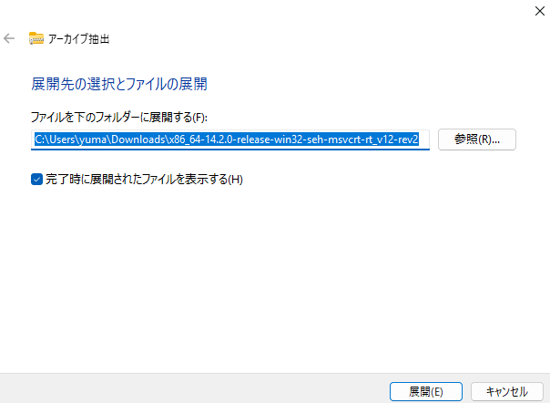
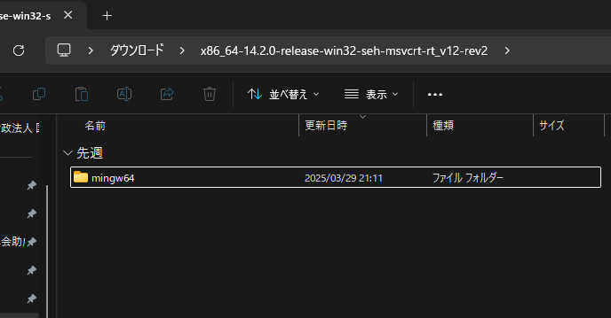
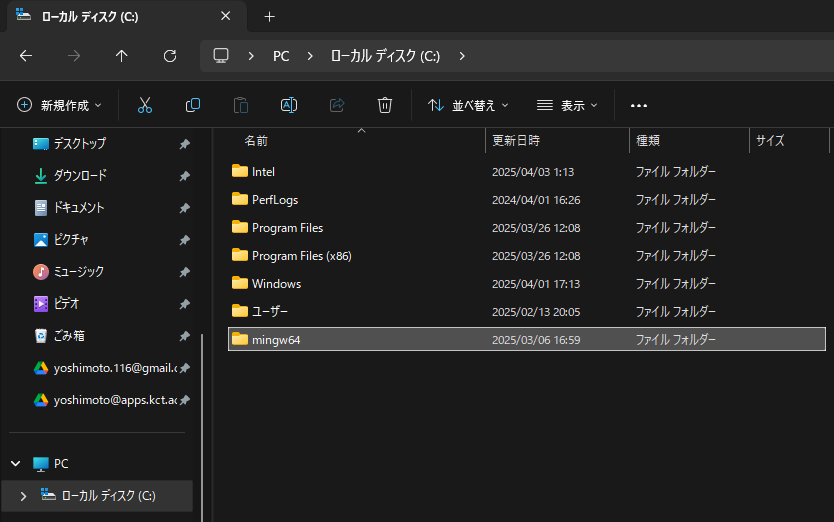
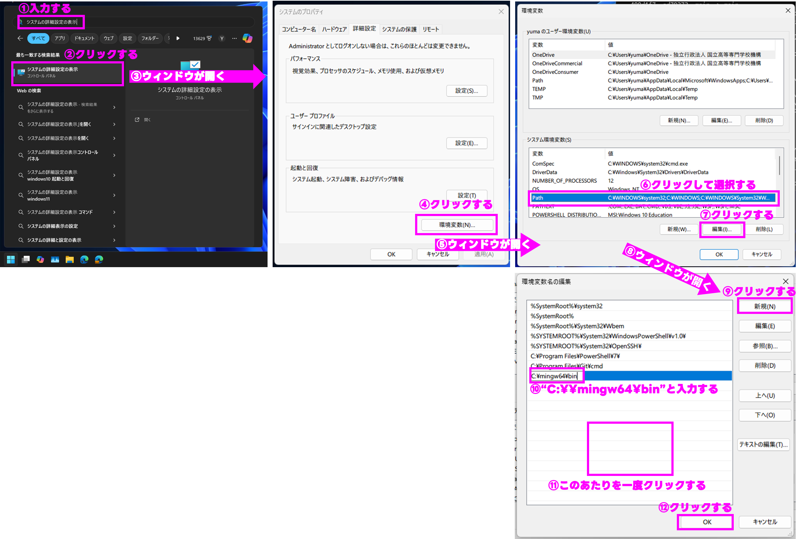

# セットアップ手順
1. [WebClassからMinGW](https://webclass.edu.kct.ac.jp/webclass/download.php/x86_64-14.2.0-release-win32-seh-msvcrt-rt_v12-rev2.7z?file=223c91bc5e25d2582492c6da3b7d2878&target_type=attach&time=1743743362&group_id=w2025-0176&contents_id=7d7f6fe7cbbd963fe97aaf00fe31c36f&uid=44839ab566ada62e20ea0e36367db25d&username=yoshimoto&realname=K_%E5%90%89%E5%85%83+%E8%A3%95%E7%9C%9F&acs_=6a7671e8&file_name=x86_64-14.2.0-release-win32-seh-msvcrt-rt_v12-rev2.7z)をダウンロードする
2. 解凍して、ファイルを配置する
	1. ダウンロードしたファイルを右クリックし、`すべて展開...`をクリックする
	2. ウィンドウが表示されるので、`展開`をクリックする（図1）
	3. ダウンロードしたファイルと同じフォルダに、解凍された「x86_64-14.2.0-release-win32-seh-msvcrt-rt_v12-rev2」フォルダが出来上がるので、開く
	4. →「mingw64」フォルダだけがあるのを確認する（図2）
	5. mingw64フォルダをCドライブ直下に移動する（図3）
3. パスの設定をする（図4参照）
	- ①  スタートメニュー上の検索バーに`システムの詳細設定の表示`と入力する
	- ② 検索されたアイテムをクリックする
	- ③ `システムのプロパティ`というウィンドウが開く
	- ④ `環境変数`ボタンをクリックする
	- ⑤ `環境変数`ウィンドウが開く
	- ⑥ <ins>下の枠（システム環境変数）のうち</ins>、`Path`を選択する
	- ⑦ `編集`ボタンをクリックする
	- ⑧ `環境変数名の編集`ウィンドウが開く
	- ⑨ `新規`ボタンをクリックする
	- ⑩ `C:\\mingw64\bin`と入力する<ins>（「｀」が入らないように注意！）</ins>
	- ⑪ ウィンドウ内の適当な箇所をクリックし、選択されているのを外す
	- ⑫ `OK`をクリックする

図1

図2

図3p

図4