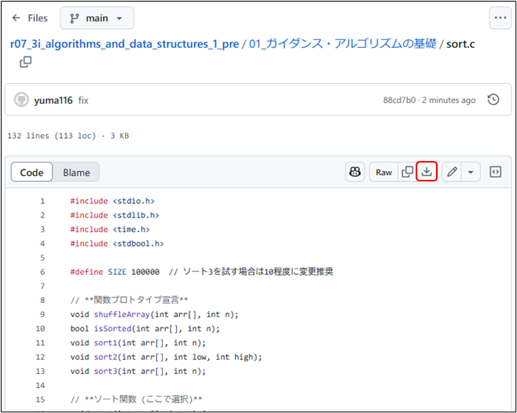

# チュートリアル：プログラムを動かしてみよう
sort.cをダウンロードして、実行する

## ダウンロード方法
1. Webページ上でコードを表示する
2. <ins>Download raw file</ins>ボタンをクリックする



## コンパイル手順
まずはそのままコンパイルしてみよう
1. Terminalを開く
2. cdコマンドを活用して、カレントディレクトリを「コードのあるフォルダ」へ移動する
3. コンパイルコマンドを実行する：`> gcc sort.c -o sort.exe`

## 実行手順
コンパイルが出来たら実行してみよう
1. 実行コマンドを走らせる： `$ ./sort.exe`
2. 下記のような出力が得られれば成功
```bash
[Terminal]
> .\sort.exe
before:
40418 47321 41641 25540 54803 ... 13455 9918 3345 29626 24478
after:
1 2 3 4 5 ... 99996 99997 99998 99999 100000
Sorting took 29.181000 seconds.
```

# アルゴリズムとは何か、何故勉強するのか
このプログラムは数列をソート（並び替える）プログラムである。まずは、アルゴリズムの効果を知る

```bash
[Terminal]
001 | > ./sort.exe
002 | before:
003 | 40418 47321 41641 25540 54803 ... 13455 9918 3345 29626 24478
004 | after:
005 | 1 2 3 4 5 ... 99996 99997 99998 99999 100000
006 | Sorting took 29.181000 seconds.
```
結果を見てみると
- 003行目：整列**前**の数列のはじめの5つと終わりの5つを表示
- 005行目：整列**後**の数列のはじめの5つと終わりの5つを表示
- 006行目：処理にかかった時間を表示

次にコードを確認する
```c++
[メイン関数]
108 | int main() {
109 |     int arr[SIZE];
110 | 
111 |     for (int i = 0; i < SIZE; i++) {
112 |         arr[i] = i + 1;
113 |     }
114 | 
115 |     srand(time(NULL));
116 |     shuffleArray(arr, SIZE);
117 | 
118 |     printf("before:\n");
119 |     printArray(arr, SIZE);
120 | 
121 |     clock_t start = clock();
122 |     sort(arr, SIZE);
123 |     clock_t end = clock();
124 | 
125 |     printf("\nafter:\n");
126 |     printArray(arr, SIZE);
127 | 
128 |     double time_taken = (double)(end - start) / CLOCKS_PER_SEC;
129 |     printf("\nSorting took %f seconds.\n", time_taken);
130 | 
131 |     return 0;
132 | }
```
- 116行目：数列を生成
- 119行目：数列をシャッフル
- 122行目：ソートを実行

ここで122行目に着目すると、sort関数が呼ばれていることが分かる

```c++
[sort関数]
015 | // **ソート関数 (ここで選択)**
016 | void sort(int arr[], int n) {
017 |     // *** 使用するソート手法を選択 ***
018 |     sort1(arr, n);
019 |     // sort2(arr, 0, n - 1);
020 |     // sort3(arr, n);
021 | }
```
sort関数を見に行くと、このプログラムには3種類のアルゴリズムが準備されており、18行目から20行目のコメントアウトでどのアルゴリズムを使用するか選択できることが分かる。

> [!CAUTION]
> [課題1]
> sort2を実行し、sort1と処理時間を比較しなさい
> また、SIZEの値を変えながらsort1とsort2のどちらでもほぼ同じ処理時間になる数値を見つけ出し、さらにSIZEの値を10倍、100倍と変えたとき、10分の1、100分の1に変えたときのSIZEの値とそれぞれの処理時間をWebClassから提出しなさい。


# 第1章 ウォーミング・アップ
# 1-0 アルゴリズムとは P.10
## 1 人間向きのアルゴリズムとコンピュータ向きのアルゴリズム

- アルゴリズム：問題を解くための論理や手順
- 人間向きのアルゴリズムは必ずしもコンピュータ向きのアルゴリズムにはならない
	- 例：225と105の最大公約数を求めるには、人間なら下図のように計算する
	- しかし、5や3のような2つの数の約数について、人間は直感で見つけている
	- これをコンピュータに行わせることは難しい


- アルゴリズムへの実装について、人間の考え方ではなく**コンピュータ向きのアルゴリズム**を考える必要がある

## 2 アルゴリズムの評価

> [!IMPORTANT]
> **良いアルゴリズムの要件**
> 1. **信頼性が高い**：精度よく正しい結果が得られる必要がある
> 2. **処理効率が良い**：計算回数が少なくて済み、処理スピードが速い。計算量の目安として**O記法**（オーダー記法）を用いた計算量オーダーを用いる
> 3. **一般性がある**：特定の状況だけでは無く、多くの状況においても通用する
> 4. **拡張性がある**：仕様変更に対し簡単に修正ができる
> 5. **わかりやすい**：誰が見ても分かりやすいこと。分かりにくいアルゴリズムはプログラムの保守性を阻害し、メンテナンスを難しくする
> 6. **移植性が高い（Porability：ポータビリティが高い）**：有用なプログラムは他機種でも使用される。その際に容易に移植できるようなアルゴリズムになっていることが重要

## 3 アルゴリズムとデータ構造
- コンピュータを使用した処理では多量のデータを扱う
- この際、取り扱うのデータをどのような**データ構造**（data structure）にするのかで、アルゴリズムが異なる
- データ構造とアルゴリズムは密接な関係にあり、よいデータ構造を選ぶことがよいプログラムを作ることに繋がる